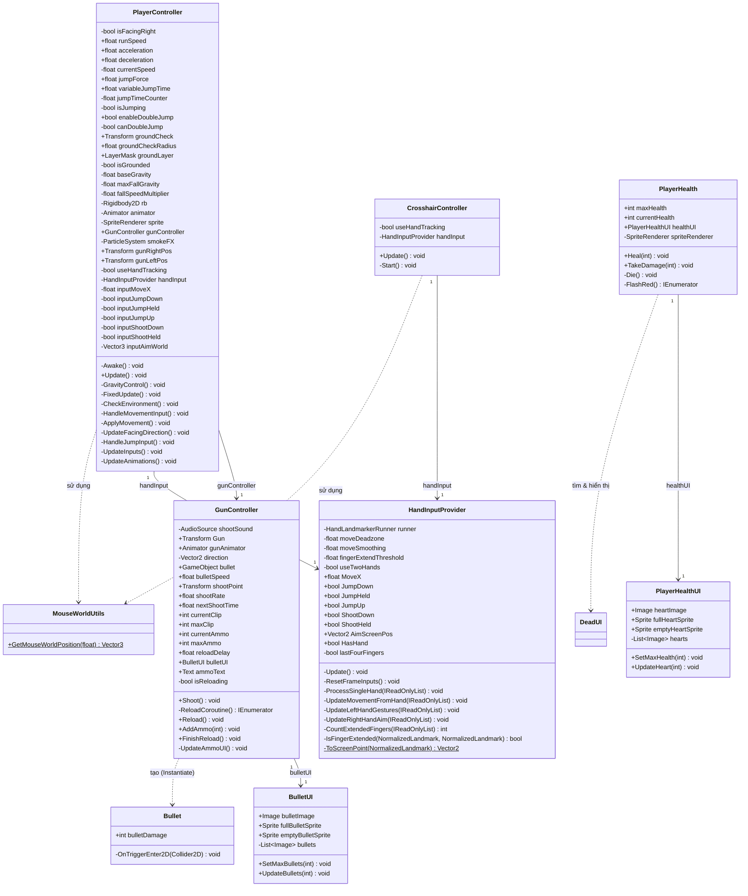
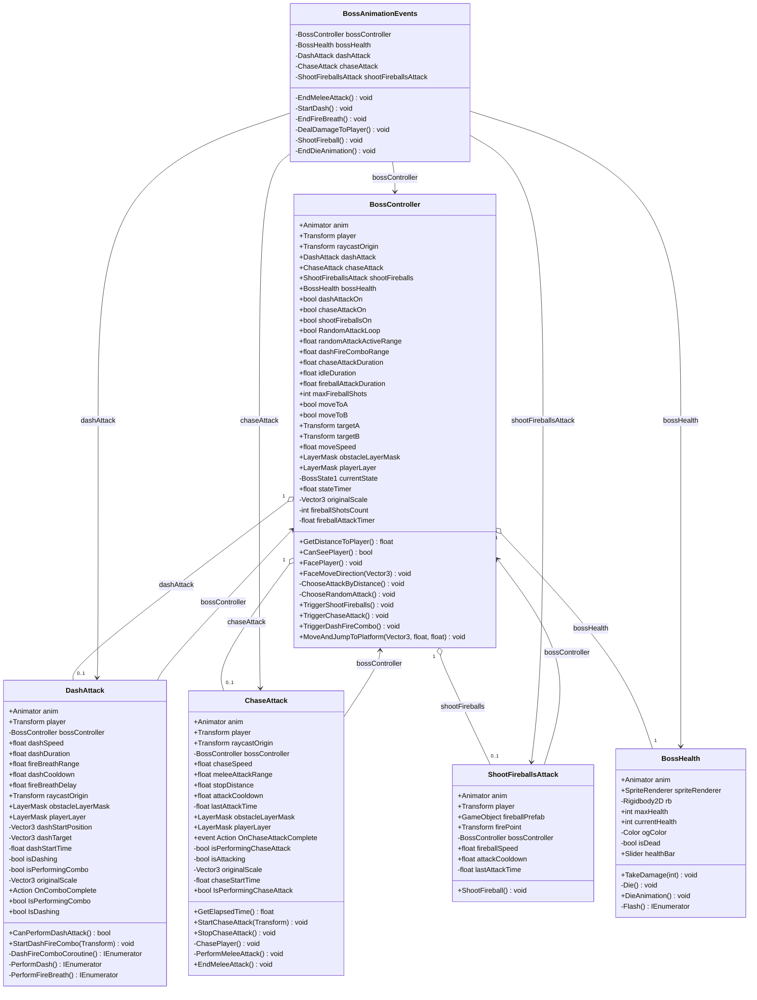
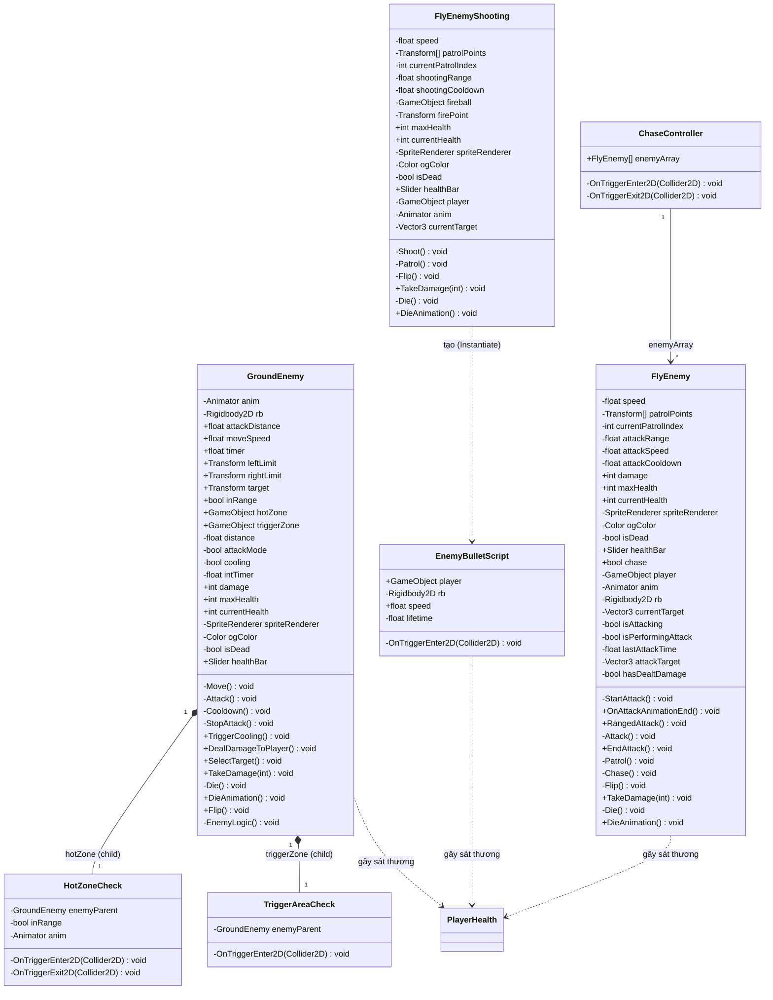

# Hướng Dẫn Vẽ Sơ Đồ Lớp (Class Diagram)

Tài liệu này hướng dẫn cách vẽ sơ đồ lớp (Class Diagram) theo chuẩn UML cho dự án game **Demon King vs Rambo Frog** (Hand Tracking). Sơ đồ lớp thể hiện cấu trúc tĩnh của hệ thống: các lớp, thuộc tính, phương thức, và các mối quan hệ giữa chúng.

---

## 1. Kiến Thức Cơ Bản Về Class Diagram

### 1.1. Class Diagram là gì?

Class Diagram (Sơ đồ lớp) là một loại sơ đồ cấu trúc trong UML (Unified Modeling Language) mô tả:

*   **Các lớp (Classes)** trong hệ thống.
*   **Thuộc tính (Attributes)** và **phương thức (Methods)** của từng lớp.
*   **Mối quan hệ (Relationships)** giữa các lớp.

### 1.2. Cấu Trúc Một Lớp Trong Sơ Đồ

Mỗi lớp được vẽ bằng **một hộp chữ nhật chia thành 3 phần** (từ trên xuống):

```
┌──────────────────────────┐
│      TÊN LỚP             │  ← Phần 1: Tên lớp (in đậm, viết hoa chữ cái đầu)
├──────────────────────────┤
│  - thuocTinh1: KieuDuLieu │  ← Phần 2: Danh sách thuộc tính
│  + thuocTinh2: KieuDuLieu │
├──────────────────────────┤
│  + PhuongThuc1(): void    │  ← Phần 3: Danh sách phương thức
│  - PhuongThuc2(): bool    │
└──────────────────────────┘
```

### 1.3. Ký Hiệu Phạm Vi Truy Cập (Access Modifiers)

| Ký hiệu | Ý nghĩa       | Trong C#     |
|----------|----------------|--------------|
| `+`      | Public         | `public`     |
| `-`      | Private        | `private`    |
| `#`      | Protected      | `protected`  |
| `~`      | Package/Internal| `internal`  |

### 1.4. Các Loại Quan Hệ Giữa Các Lớp

| Loại quan hệ          | Ký hiệu mũi tên        | Ý nghĩa                                                                  | Ví dụ trong dự án                                   |
|------------------------|-------------------------|---------------------------------------------------------------------------|-----------------------------------------------------|
| **Association** (Liên kết)  | `──────>`          | Lớp A có tham chiếu (reference) đến lớp B                                | `PlayerController` → `GunController`                |
| **Composition** (Hợp thành) | `◆──────>`         | Lớp B không thể tồn tại nếu thiếu lớp A (quan hệ "chứa" - toàn phần)    | `GroundEnemy` ◆→ `HotZoneCheck`                     |
| **Aggregation** (Tập hợp)   | `◇──────>`         | Lớp B có thể tồn tại độc lập ngoài lớp A (quan hệ "có" - một phần)      | `BossController` ◇→ `DashAttack`                    |
| **Dependency** (Phụ thuộc)   | `- - - - ->`       | Lớp A sử dụng lớp B nhưng không lưu reference lâu dài                   | `Bullet` ‑ ‑ > `GroundEnemy` (gọi `TakeDamage`)    |
| **Inheritance** (Kế thừa)    | `────────▷`        | Lớp con kế thừa từ lớp cha                                               | Tất cả lớp kế thừa `MonoBehaviour`                  |
| **Realization** (Hiện thực)  | `- - - - -▷`       | Lớp hiện thực một Interface                                               | *(Không có trong dự án này)*                        |

---

## 2. Phân Tích Các Lớp Trong Dự Án

Dự án được chia thành **6 nhóm (Package)** chính:

| # | Nhóm (Package)            | Các lớp                                                                                                        |
|---|---------------------------|----------------------------------------------------------------------------------------------------------------|
| 1 | **Player (Người chơi)**   | `PlayerController`, `GunController`, `PlayerHealth`, `Bullet`, `PlayerHealthUI`, `BulletUI`, `CrosshairController` |
| 2 | **Hand Tracking (Input)** | `HandInputProvider`, `MouseWorldUtils`                                                                         |
| 3 | **Boss (Demon King)**     | `BossController`, `BossHealth`, `BossAnimationEvents`, `ChaseAttack`, `DashAttack`, `ShootFireballsAttack`      |
| 4 | **Enemy (Kẻ địch)**       | `GroundEnemy`, `HotZoneCheck`, `TriggerAreaCheck`, `FlyEnemy`, `FlyEnemyShooting`, `ChaseController`, `EnemyBulletScript` |
| 5 | **Items (Vật phẩm)**      | `AmmoPickup`, `HealthItem`                                                                                     |
| 6 | **Environment (Môi trường)** | `Deadzone`, `FallTrap`, `NextLV`, `ForwardOnlyCamera`, `LeftBoundary`, `BackgroundController`, `MainMenu`, `PauseMenu`, `DeadUI`, `WinerUI`, `AudioManager` |

---

## 3. Ký Hiệu UML Được Sử Dụng (Tóm Tắt Nhanh)

Khi vẽ Class Diagram trên Draw.io hoặc công cụ khác, hãy tuân thủ các ký hiệu sau:

1.  **Hộp chữ nhật 3 phần** cho mỗi Class.
2.  **Đường liền nét + mũi tên rỗng** (`▷`) cho quan hệ **Kế thừa** (Inheritance).
3.  **Đường liền nét + mũi tên đặc** (`>`) cho quan hệ **Liên kết** (Association).
4.  **Đường liền nét + hình thoi đặc** (`◆`) cho **Hợp thành** (Composition).
5.  **Đường liền nét + hình thoi rỗng** (`◇`) cho **Tập hợp** (Aggregation).
6.  **Đường đứt nét + mũi tên đặc** (`-->`) cho **Phụ thuộc** (Dependency).
7.  **Nhãn số lượng (Multiplicity)**: `1`, `0..1`, `1..*`, `*` đặt ở hai đầu đường nối.

---

## 4. Mã Code Mermaid (Class Diagram Hoàn Chỉnh)

### 4.1. Nhóm Player & Hand Tracking



### 4.2. Nhóm Boss (Demon King)



### 4.3. Nhóm Enemy (Kẻ Địch)



### 4.4. Nhóm Items & Environment

```mermaid
classDiagram
    direction TB

    class AmmoPickup {
        +int ammoAmount
        -OnTriggerEnter2D(Collider2D) void
    }

    class HealthItem {
        +int healAmount
        -OnTriggerEnter2D(Collider2D) void
    }

    class Deadzone {
        -OnTriggerEnter2D(Collider2D) void
    }

    class FallTrap {
        -Rigidbody2D rb
        -bool daroi
        +Transform diemkhoiphuc
        -OnTriggerEnter2D(Collider2D) void
        -OnCollisionEnter2D(Collision2D) void
        -khoiphuc() void
    }

    class NextLV {
        +string nextLV2
        +loadNextLevel() void
        -OnTriggerEnter2D(Collider2D) void
    }

    class ForwardOnlyCamera {
        +Transform target
        +float fixedY
        -float minCameraX
        -LateUpdate() void
    }

    class LeftBoundary {
        +float pushForce
        -OnTriggerStay2D(Collider2D) void
    }

    class BackgroundController {
        -float starPs
        -float length
        +GameObject cam
        +float parallaxEffect
        -FixedUpdate() void
    }

    class MainMenu {
        +PlayGame() void
        +QuitGame() void
    }

    class PauseMenu {
        -GameObject pauseMenu
        +PauseGame() void
        +Home() void
        +Exit() void
        +Restart() void
    }

    class DeadUI {
        -GameObject deadPanel
        -TextMeshProUGUI deathMessageText
        +ShowDeadPanel() void
        +ShowDeadPanelWithMessage(string) void
        +Restart() void
        +MainMenu() void
        +QuitGame() void
    }

    class WinerUI {
        -GameObject winnerPanel
        -TextMeshProUGUI winMessageText
        -BossHealth bossHealth
        +ShowWinnerPanel() void
    }

    class AudioManager {
        +AudioSource musicSource
        +AudioSource vfxSource
        +AudioClip musicClip
    }

    AmmoPickup ..> GunController : gọi AddAmmo()
    HealthItem ..> PlayerHealth : gọi Heal()
    Deadzone ..> DeadUI : gọi ShowDeadPanelWithMessage()
    FallTrap ..> DeadUI : gọi ShowDeadPanelWithMessage()
    WinerUI --> BossHealth : theo dõi currentHealth
```



---

## 5. Bảng Tổng Hợp Quan Hệ Giữa Các Lớp

| Lớp A                  | Quan hệ        | Lớp B                  | Mô tả                                               |
|-------------------------|-----------------|-------------------------|------------------------------------------------------|
| `PlayerController`      | Association →   | `GunController`         | Gọi `Shoot()`, kiểm soát vị trí/xoay súng           |
| `PlayerController`      | Association →   | `HandInputProvider`     | Đọc tín hiệu điều khiển từ Hand Tracking            |
| `PlayerController`      | Dependency ⇢    | `MouseWorldUtils`       | Gọi static method khi không dùng Hand Tracking      |
| `GunController`         | Association →   | `BulletUI`              | Cập nhật giao diện đạn                               |
| `GunController`         | Dependency ⇢    | `Bullet`                | Tạo đạn mới bằng `Instantiate()`                    |
| `PlayerHealth`          | Association →   | `PlayerHealthUI`        | Cập nhật giao diện máu người chơi                   |
| `PlayerHealth`          | Dependency ⇢    | `DeadUI`                | Tìm và gọi `ShowDeadPanel()` khi chết               |
| `CrosshairController`   | Association →   | `HandInputProvider`     | Lấy vị trí ngắm từ Hand Tracking                    |
| `BossController`        | Aggregation ◇→  | `DashAttack`            | Quản lý module tấn công lướt                         |
| `BossController`        | Aggregation ◇→  | `ChaseAttack`           | Quản lý module tấn công đuổi                         |
| `BossController`        | Aggregation ◇→  | `ShootFireballsAttack`  | Quản lý module bắn cầu lửa                          |
| `BossController`        | Aggregation ◇→  | `BossHealth`            | Theo dõi máu Boss                                    |
| `BossAnimationEvents`   | Association →   | `BossController`        | Nhận reference từ parent để xử lý Animation Event   |
| `BossAnimationEvents`   | Association →   | `BossHealth`            | Gọi `DieAnimation()`                                |
| `BossAnimationEvents`   | Association →   | `DashAttack`            | Lấy reference player để gây sát thương              |
| `BossAnimationEvents`   | Association →   | `ChaseAttack`           | Gọi `EndMeleeAttack()`                              |
| `BossAnimationEvents`   | Association →   | `ShootFireballsAttack`  | Gọi `ShootFireball()`                               |
| `ChaseAttack`           | Association →   | `BossController`        | Gọi `GetDistanceToPlayer()`, `CanSeePlayer()`       |
| `DashAttack`            | Association →   | `BossController`        | Gọi `GetDistanceToPlayer()`, `CanSeePlayer()`       |
| `ShootFireballsAttack`  | Association →   | `BossController`        | Lấy vị trí player                                   |
| `GroundEnemy`           | Composition ◆→  | `HotZoneCheck`          | HotZone là child object của GroundEnemy              |
| `GroundEnemy`           | Composition ◆→  | `TriggerAreaCheck`      | TriggerArea là child object của GroundEnemy           |
| `GroundEnemy`           | Dependency ⇢    | `PlayerHealth`          | Gọi `TakeDamage()` qua Animation Event              |
| `FlyEnemy`              | Dependency ⇢    | `PlayerHealth`          | Gọi `TakeDamage()` khi va chạm                      |
| `ChaseController`       | Association →   | `FlyEnemy[]`            | Bật/tắt `chase` cho mảng FlyEnemy                   |
| `FlyEnemyShooting`      | Dependency ⇢    | `EnemyBulletScript`     | Tạo đạn enemy bằng `Instantiate()`                  |
| `EnemyBulletScript`     | Dependency ⇢    | `PlayerHealth`          | Gọi `TakeDamage()` khi va chạm player               |
| `Bullet`                | Dependency ⇢    | `GroundEnemy`           | Gọi `TakeDamage()` khi va chạm                      |
| `Bullet`                | Dependency ⇢    | `FlyEnemy`              | Gọi `TakeDamage()` khi va chạm                      |
| `Bullet`                | Dependency ⇢    | `FlyEnemyShooting`      | Gọi `TakeDamage()` khi va chạm                      |
| `Bullet`                | Dependency ⇢    | `BossHealth`            | Gọi `TakeDamage()` khi va chạm                      |
| `AmmoPickup`            | Dependency ⇢    | `GunController`         | Gọi `AddAmmo()`                                     |
| `HealthItem`            | Dependency ⇢    | `PlayerHealth`          | Gọi `Heal()`                                        |
| `Deadzone`              | Dependency ⇢    | `DeadUI`                | Gọi `ShowDeadPanelWithMessage()`                     |
| `FallTrap`              | Dependency ⇢    | `DeadUI`                | Gọi `ShowDeadPanelWithMessage()`                     |
| `WinerUI`               | Association →   | `BossHealth`            | Theo dõi `currentHealth` mỗi frame                  |

---

## 6. Hướng Dẫn Vẽ Class Diagram Trên Draw.io

### Bước 1: Mở Draw.io và tạo file mới

1.  Truy cập [Draw.io](https://app.diagrams.net).
2.  Chọn **Create New Diagram** → chọn template **UML Class Diagram** hoặc **Blank Diagram**.

### Bước 2: Sử dụng thư viện hình UML

1.  Ở panel bên trái, bấm **+ More Shapes** → bật nhóm **UML** (hoặc **UML 2.5**).
2.  Tìm hình **Class** (hộp chữ nhật 3 phần) và kéo thả vào canvas.

### Bước 3: Tạo các lớp

1.  **Double-click** vào phần tiêu đề của Class để đổi tên (ví dụ: `PlayerController`).
2.  **Double-click** vào phần giữa để thêm thuộc tính. Mỗi thuộc tính trên 1 dòng, theo định dạng: `- tenThuocTinh: KieuDuLieu`
3.  **Double-click** vào phần dưới để thêm phương thức. Mỗi phương thức trên 1 dòng, theo định dạng: `+ TenPhuongThuc(thamSo): KieuTraVe`

### Bước 4: Nối các quan hệ

1.  Chọn loại đường nối phù hợp từ thanh công cụ:
    *   **Đường thẳng + mũi tên tam giác rỗng** → Inheritance (kế thừa).
    *   **Đường thẳng + mũi tên đặc** → Association (liên kết).
    *   **Đường thẳng + hình thoi rỗng** → Aggregation (tập hợp).
    *   **Đường thẳng + hình thoi đặc** → Composition (hợp thành).
    *   **Đường đứt nét + mũi tên đặc** → Dependency (phụ thuộc).
2.  Kéo đường nối từ lớp A đến lớp B.
3.  **Double-click** vào đường nối để thêm nhãn quan hệ (ví dụ: `gunController`, `1..*`).

### Bước 5: Nhập sơ đồ từ Mermaid (Tùy chọn nhanh)

1.  Bấm **+ (Insert)** → **Advanced** → **Mermaid**.
2.  Sao chép đoạn mã Mermaid ở **Mục 4** và dán vào hộp thoại.
3.  Bấm **Insert** để Draw.io tự động sinh sơ đồ.
4.  Sau đó chỉnh sửa bố cục, màu sắc, và thêm/bớt chi tiết theo ý muốn.

### Bước 6: Sắp xếp bố cục

Tổ chức sơ đồ theo các nhóm (Package):

```
┌───────────────────────────────────────────────────────────────────┐
│                    PACKAGE: PLAYER & INPUT                        │
│  ┌────────────────┐  ┌───────────────┐  ┌──────────────────┐     │
│  │PlayerController │→│ GunController  │  │ HandInputProvider│     │
│  └────────────────┘  └───────────────┘  └──────────────────┘     │
│  ┌────────────────┐  ┌───────────────┐  ┌───────────────────┐    │
│  │ PlayerHealth   │→│PlayerHealthUI  │  │CrosshairController│    │
│  └────────────────┘  └───────────────┘  └───────────────────┘    │
│  ┌────────────────┐  ┌───────────────┐  ┌───────────────────┐    │
│  │    Bullet      │  │   BulletUI    │  │ MouseWorldUtils   │    │
│  └────────────────┘  └───────────────┘  └───────────────────┘    │
└───────────────────────────────────────────────────────────────────┘

┌───────────────────────────────────────────────────────────────────┐
│                    PACKAGE: BOSS (DEMON KING)                     │
│  ┌────────────────┐  ┌───────────────┐  ┌──────────────────────┐ │
│  │ BossController │◇→│  DashAttack   │  │ShootFireballsAttack  │ │
│  └────────────────┘  └───────────────┘  └──────────────────────┘ │
│  ┌────────────────┐  ┌───────────────┐  ┌──────────────────────┐ │
│  │  BossHealth    │  │  ChaseAttack  │  │ BossAnimationEvents  │ │
│  └────────────────┘  └───────────────┘  └──────────────────────┘ │
└───────────────────────────────────────────────────────────────────┘

┌───────────────────────────────────────────────────────────────────┐
│                    PACKAGE: ENEMY (KẺ ĐỊCH)                       │
│  ┌────────────────┐  ┌───────────────┐  ┌──────────────────────┐ │
│  │  GroundEnemy   │◆→│ HotZoneCheck  │  │  TriggerAreaCheck    │ │
│  └────────────────┘  └───────────────┘  └──────────────────────┘ │
│  ┌────────────────┐  ┌────────────────┐ ┌──────────────────────┐ │
│  │   FlyEnemy     │  │FlyEnemyShooting│ │   ChaseController    │ │
│  └────────────────┘  └────────────────┘ └──────────────────────┘ │
│  ┌──────────────────┐                                            │
│  │EnemyBulletScript │                                            │
│  └──────────────────┘                                            │
└───────────────────────────────────────────────────────────────────┘
```

### Bước 7: Tô màu và hoàn thiện

*   **Package Player**: Dùng nền xanh dương nhạt (`#DBEAFE`).
*   **Package Boss**: Dùng nền đỏ nhạt (`#FEE2E2`).
*   **Package Enemy**: Dùng nền vàng nhạt (`#FEF3C7`).
*   **Package Items**: Dùng nền xanh lá nhạt (`#D1FAE5`).
*   **Package Environment**: Dùng nền tím nhạt (`#EDE9FE`).
*   Thêm **tiêu đề nhóm** bằng cách dùng hình **Rectangle** lớn bao quanh các lớp cùng nhóm.

---

## 7. Mẹo Vẽ Class Diagram Chuẩn

1.  **Chỉ hiển thị thuộc tính và phương thức quan trọng**: Không cần liệt kê hết tất cả. Ưu tiên các thuộc tính `public` và các phương thức cốt lõi.
2.  **Đặt lớp quan trọng nhất ở trung tâm**: `PlayerController` và `BossController` nên ở giữa vì chúng có nhiều quan hệ nhất.
3.  **Mũi tên phụ thuộc (Dependency)** nên dùng đường đứt nét để phân biệt rõ với Association.
4.  **Sử dụng Multiplicity** (nhãn số lượng `1`, `*`, `0..1`) ở hai đầu đường nối để thể hiện số lượng đối tượng tham gia quan hệ.
5.  **Giảm đường chéo**: Cố gắng sắp xếp các lớp sao cho các đường nối chủ yếu đi theo chiều dọc hoặc ngang, tránh đường chéo quá nhiều gây rối.

---

## 8. Enum Nội Bộ (Lưu Ý)

Lớp `BossController` chứa một **enum nội bộ** quan trọng:

```
«enumeration»
BossState1
───────────
Idle
DashFireCombo
ShootFireballs
ChaseAttack
```

Khi vẽ, bạn có thể biểu diễn enum này bằng một hộp riêng có nhãn `«enumeration»` ở phía trên tên, rồi nối vào `BossController` bằng đường Dependency.
