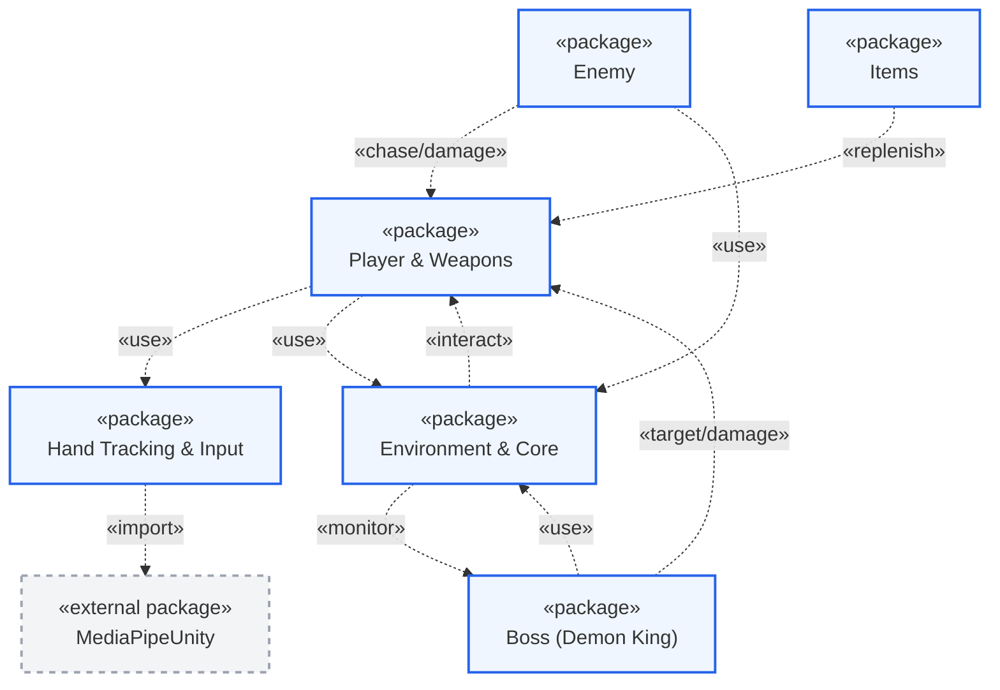
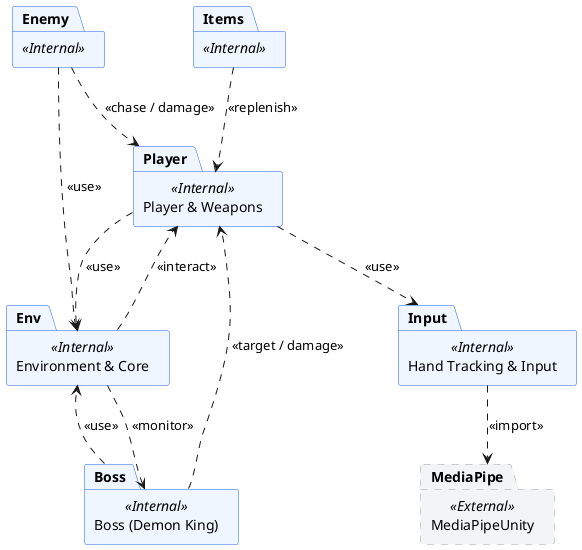

# Hướng Dẫn Vẽ Sơ Đồ Gói (Package Diagram)

Tài liệu này cung cấp cấu trúc phân nhóm (Package) và mối quan hệ phụ thuộc (Dependencies) của dự án game **Demon King vs Rambo Frog** (Hand Tracking). 

Dưới đây là nội dung chi tiết mô tả hệ thống dưới dạng sơ đồ gói UML. Bạn có thể **sao chép toàn bộ nội dung tài liệu này** hoặc **đoạn mã Mermaid / PlantUML** phía dưới để dán vào Gemini, Draw.io, hoặc các công cụ tương thích để vẽ sơ đồ.

---

## 1. Cấu Trúc Các Gói (Packages) & Thành Phần

Hệ thống được tổ chức thành **6 gói nội bộ (Internal Packages)** và **1 gói thư viện ngoài (External Package)**:

### 1.1. Gói `Hand Tracking & Input` (Hệ thống nhận diện cử chỉ)
*   **Mô tả:** Chịu trách nhiệm xử lý đầu vào từ camera thông qua Mediapipe, nhận dạng cử chỉ tay và cung cấp các trạng thái điều khiển (Move, Jump, Shoot, Aim) cho nhân vật.
*   **Các lớp bên trong:**
    *   `HandInputProvider.cs`: Đọc Landmark từ bàn tay, tính toán số ngón tay xòe, khoảng cách giữa ngón cái và ngón trỏ để đưa ra tín hiệu nhảy/bắn/di chuyển.
    *   `MouseWorldUtils.cs`: Tiện ích phụ trợ hỗ trợ đổi tọa độ chuột khi không sử dụng Hand Tracking.

### 1.2. Gói `Player & Weapons` (Người chơi & Vũ khí)
*   **Mô tả:** Quản lý nhân vật chính (Rambo Frog), cơ chế vật lý (di chuyển, nhảy thường, nhảy kép), cơ chế bắn súng, lượng đạn, lượng máu và hiển thị UI tương ứng của người chơi.
*   **Các lớp bên trong:**
    *   `PlayerController.cs`: Điều khiển di chuyển, nhảy, liên kết cử chỉ tay hoặc bàn phím/chuột.
    *   `GunController.cs`: Quản lý bắn đạn, băng đạn, nạp đạn (Reload) và thêm đạn.
    *   `PlayerHealth.cs`: Quản lý lượng máu người chơi, nhận sát thương và kích hoạt màn hình Game Over.
    *   `Bullet.cs`: Quản lý hành vi đạn của người chơi khi va chạm với kẻ địch hoặc Boss.
    *   `PlayerHealthUI.cs` & `BulletUI.cs`: Cập nhật hiển thị số tim máu và đạn trên giao diện HUD.
    *   `CrosshairController.cs`: Quản lý hồng tâm ngắm bắn di chuyển theo tay hoặc chuột.

### 1.3. Gói `Boss (Demon King)` (Hệ thống Boss)
*   **Mô tả:** Quản lý AI của Boss Demon King với các trạng thái tấn công phức tạp dựa trên khoảng cách hoặc lựa chọn ngẫu nhiên.
*   **Các lớp bên trong:**
    *   `BossController.cs`: State Machine (Máy trạng thái) chính của Boss, quyết định hành vi di chuyển và lựa chọn chiêu thức.
    *   `BossHealth.cs`: Quản lý máu Boss, hiển thị thanh máu trượt (Slider) và xử lý sự kiện khi Boss bị tiêu diệt.
    *   `BossAnimationEvents.cs`: Cầu nối kích hoạt các hành động thực tế (bắn cầu lửa, lướt, gây dame) từ Animation.
    *   `ChaseAttack.cs`: Module quản lý đòn tấn công đuổi theo và cận chiến.
    *   `DashAttack.cs`: Module quản lý combo lướt nhanh và phun lửa.
    *   `ShootFireballsAttack.cs`: Module quản lý bắn các cầu lửa từ xa.

### 1.4. Gói `Enemy` (Kẻ địch thông thường)
*   **Mô tả:** Quản lý các loại kẻ địch tuần tra trên mặt đất hoặc bay trên không.
*   **Các lớp bên trong:**
    *   `GroundEnemy.cs`: Kẻ địch đi bộ tuần tra, đuổi theo và cận chiến người chơi.
    *   `HotZoneCheck.cs` & `TriggerAreaCheck.cs`: Các vùng cảm biến phát hiện người chơi của kẻ địch mặt đất.
    *   `FlyEnemy.cs`: Kẻ địch bay tuần tra theo các điểm mốc và đuổi theo tấn công cận chiến.
    *   `FlyEnemyShooting.cs`: Kẻ địch bay có khả năng bắn đạn tầm xa.
    *   `EnemyBulletScript.cs`: Đạn do kẻ địch bắn ra gây sát thương cho người chơi.
    *   `ChaseController.cs`: Quản lý việc kích hoạt trạng thái truy đuổi hàng loạt cho các kẻ địch bay.

### 1.5. Gói `Items` (Vật phẩm hỗ trợ)
*   **Mô tả:** Các vật phẩm tương tác đặt trên bản đồ giúp bổ sung tài nguyên cho người chơi.
*   **Các lớp bên trong:**
    *   `AmmoPickup.cs`: Hộp đạn giúp người chơi hồi lại đạn dự trữ khi nhặt.
    *   `HealthItem.cs`: Vật phẩm hồi máu (tim) khi người chơi chạm phải.

### 1.6. Gói `Environment & Core` (Môi trường & Hệ thống chung)
*   **Mô tả:** Quản lý âm thanh, camera, chuyển màn chơi, các bẫy môi trường và các màn hình giao diện chính (Menu, Tạm dừng, Thua, Thắng).
*   **Các lớp bên trong:**
    *   `Deadzone.cs` & `FallTrap.cs`: Các bẫy rơi vực sâu và bẫy gai gây sát thương/chết người.
    *   `NextLV.cs`: Cổng dịch chuyển chuyển tiếp sang màn chơi mới.
    *   `ForwardOnlyCamera.cs`: Camera chỉ di chuyển tiến lên theo người chơi.
    *   `LeftBoundary.cs`: Biên giới hạn bên trái ngăn không cho người chơi đi lùi lại.
    *   `BackgroundController.cs`: Hiệu ứng Parallax cho nền 2D di chuyển theo camera.
    *   `AudioManager.cs`: Quản lý nhạc nền và âm thanh hiệu ứng (súng, va chạm).
    *   `MainMenu.cs`, `PauseMenu.cs`, `DeadUI.cs`, `WinerUI.cs`: Quản lý các trạng thái màn hình giao diện UI của trò chơi.

### 1.7. Gói `MediaPipeUnity` (Thư viện ngoài - External)
*   **Mô tả:** Thư viện chạy nền Mediapipe tích hợp vào Unity để phát hiện bàn tay qua webcam.

---

## 2. Mối Quan Hệ Phụ Thuộc (Dependencies)

Mối quan hệ phụ thuộc giữa các Package được định nghĩa như sau:

1.  **`Hand Tracking & Input`** phụ thuộc (`<<import>>`) vào **`MediaPipeUnity`**: Đọc dữ liệu từ webcam qua Mediapipe để chuyển hóa thành các Landmark tay.
2.  **`Player & Weapons`** phụ thuộc (`<<use>>`) vào **`Hand Tracking & Input`**: Lấy thông tin điều khiển cử chỉ từ `HandInputProvider` để áp dụng cho `PlayerController` và `CrosshairController`.
3.  **`Player & Weapons`** phụ thuộc (`<<use>>`) vào **`Environment & Core`**: Kích hoạt `DeadUI` khi hết máu, phát âm thanh qua `AudioManager`.
4.  **`Boss (Demon King)`** phụ thuộc (`<<target / damage>>`) vào **`Player & Weapons`**: Tìm vị trí người chơi để đuổi theo bắn đạn, trực tiếp gọi hàm `TakeDamage` trên `PlayerHealth`.
5.  **`Boss (Demon King)`** phụ thuộc (`<<use>>`) vào **`Environment & Core`**: Sử dụng `AudioManager` và kích hoạt `WinerUI` khi Boss bị tiêu diệt.
6.  **`Enemy`** phụ thuộc (`<<chase / damage>>`) vào **`Player & Weapons`**: Tuần tra phát hiện và đuổi theo người chơi, gây sát thương lên `PlayerHealth`. Đạn từ `EnemyBulletScript` cũng gây sát thương lên người chơi.
7.  **`Items`** phụ thuộc (`<<replenish>>`) vào **`Player & Weapons`**: Khi kích hoạt trigger nhặt đồ sẽ gọi hàm `AddAmmo` của `GunController` hoặc `Heal` của `PlayerHealth`.
8.  **`Environment & Core`** phụ thuộc (`<<interact>>`) vào **`Player & Weapons`**: Kiểm tra va chạm của người chơi với bẫy (`FallTrap`, `Deadzone`), giới hạn biên (`LeftBoundary`), hoặc cổng chuyển màn (`NextLV`) để hiển thị màn hình thua cuộc (`DeadUI`) hoặc chuyển cảnh.
9.  **`Environment & Core`** phụ thuộc (`<<monitor>>`) vào **`Boss (Demon King)`**: Lớp `WinerUI` liên tục kiểm tra lượng máu của Boss từ `BossHealth` để hiển thị bảng chiến thắng khi Boss chết.

---

## 3. Mã Sơ Đồ Để Dán Vào Công Cụ Vẽ (Đã Tối Ưu Đơn Giản)

> [!NOTE]
> Để sơ đồ gói (Package Diagram) chuẩn UML và trực quan hơn, mã vẽ dưới đây chỉ tập trung vào mối quan hệ phụ thuộc giữa các **gói lớn (Packages)** thay vì liệt kê từng file script riêng lẻ bên trong. Điều này giúp sơ đồ gọn gàng, giảm thiểu phụ thuộc chồng chéo trực quan và phản ánh đúng bản chất kiến trúc hệ thống.

### 3.1. Mã Sơ Đồ Mermaid (Dán vào Gemini, Notion, GitHub hoặc Draw.io)

### 3.2. Mã Sơ Đồ PlantUML (Phù hợp để vẽ nâng cao)

---

## 4. Phân Tích Quan Hệ Phụ Thuộc Vòng (Circular Dependencies) trong Dự Án

Trong dự án thực tế hiện tại, chúng ta có một số mối quan hệ **phụ thuộc vòng (Circular Dependencies)** giữa các Package:
1. **Player & Weapons <---> Environment & Core**: Player cần gọi hệ thống UI (`DeadUI`) và âm thanh (`AudioManager`) trong Environment. Ngược lại, Environment (`FallTrap`, `Deadzone`, `LeftBoundary`) lại cần tham chiếu trực tiếp đến Player để xử lý va chạm và hồi sinh.
2. **Boss (Demon King) <---> Environment & Core**: Boss cần sử dụng `AudioManager` và kích hoạt `WinerUI`. Ngược lại, `WinerUI` trong Environment lại cần tham chiếu trực tiếp đến `BossHealth` để theo dõi máu của Boss.

> [!TIP]
> **Giải pháp tối ưu hóa kiến trúc (nếu muốn làm sạch code):**
> Để loại bỏ các phụ thuộc vòng này, bạn có thể áp dụng mô hình **Event-driven (Hướng sự kiện)**:
> - Sử dụng **C# Events / Action** hoặc **ScriptableObject Events** để phát các sự kiện (ví dụ: `OnPlayerDie`, `OnBossDie`).
> - Package `Environment & Core` sẽ lắng nghe các sự kiện này để hiển thị UI tương ứng, thay vì các package trực tiếp gọi hoặc tham chiếu xuyên suốt lẫn nhau.

---

## 5. Hướng dẫn dán vào Gemini / Draw.io để tạo sơ đồ

Bạn có thể sao chép mã Mermaid ở **Mục 3.1** hoặc mã PlantUML ở **Mục 3.2** dán vào các công cụ tự động tạo sơ đồ. Nếu dán vào Gemini, bạn có thể dùng câu lệnh sau:

> **Câu lệnh gợi ý (Prompt):**
> "Hãy dựa trên cấu trúc các package và mối quan hệ phụ thuộc được mô tả ở trên để vẽ/tạo ra sơ đồ Package Diagram (Sơ đồ gói) UML hoàn chỉnh cho dự án game này. Hãy đảm bảo các mũi tên phụ thuộc chỉ đúng hướng và phân biệt rõ các gói thư viện ngoài (MediaPipeUnity) và các gói nội bộ của game."

