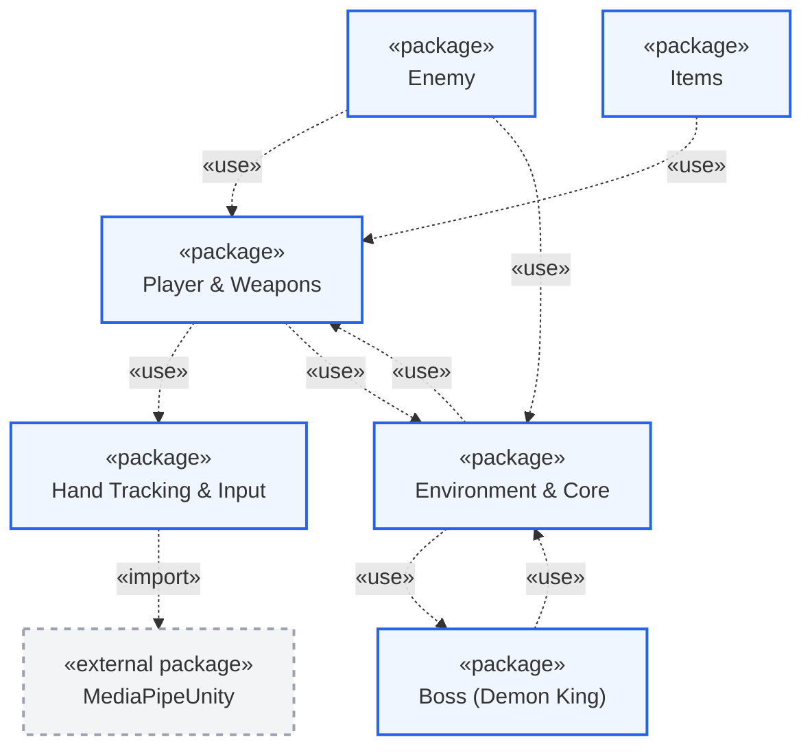
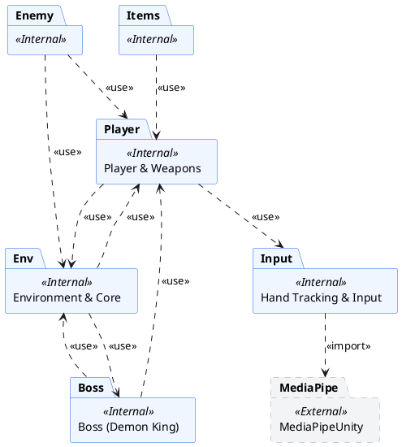
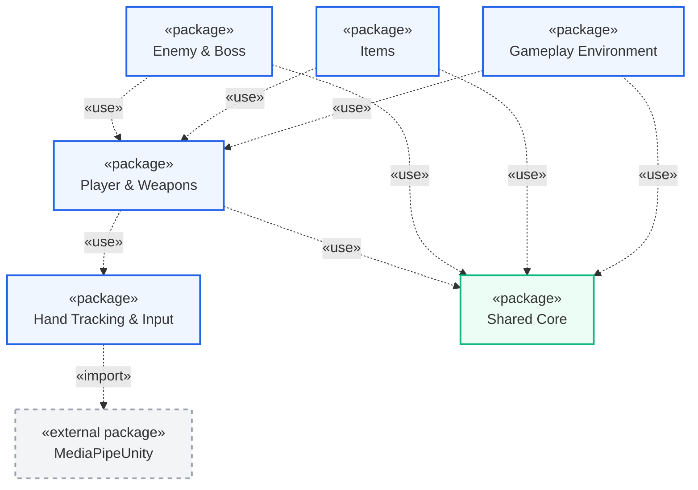
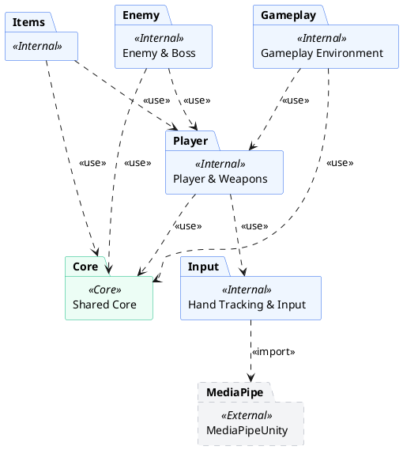

# Hướng Dẫn Vẽ Sơ Đồ Gói (Package Diagram)

Tài liệu này cung cấp cấu trúc phân nhóm (Package) và mối quan hệ phụ thuộc (Dependencies) của dự án game **Demon King vs Rambo Frog** (Hand Tracking). 

Dưới đây là nội dung chi tiết mô tả hệ thống dưới dạng sơ đồ gói UML. Bạn có thể **sao chép toàn bộ nội dung tài liệu này** hoặc **đoạn mã Mermaid / PlantUML** phía dưới để dán vào Gemini, Draw.io, hoặc các công cụ tương thích để vẽ sơ đồ.

---

## 1. Cấu Trúc Các Gói (Packages) & Thành Phần

Hệ thống được tổ chức thành **6 gói nội bộ (Internal Packages)** và **1 gói thư viện ngoài (External Package)**:

### 1.1. Gói `Hand Tracking & Input` (Hệ thống nhận diện cử chỉ)
*   **Mô tả:** Chịu trách nhiệm xử lý đầu vào từ camera thông qua Mediapipe, nhận dạng cử chỉ tay và cung cấp các trạng thái điều khiển (Move, Jump, Shoot, Aim) cho nhân vật.
*   **Các lớp bên trong:**
    *   `HandInputProvider.cs`: Đọc Landmark từ bàn tay, tính toán số ngón tay xòe, khoảng cách giữa ngón cái và ngón trỏ để đưa ra tín hiệu nhảy/bắn/di chuyển.
    *   `MouseWorldUtils.cs`: Tiện ích phụ trợ hỗ trợ đổi tọa độ chuột khi không sử dụng Hand Tracking.

### 1.2. Gói `Player & Weapons` (Người chơi & Vũ khí)
*   **Mô tả:** Quản lý nhân vật chính (Rambo Frog), cơ chế vật lý (di chuyển, nhảy thường, nhảy kép), cơ chế bắn súng, lượng đạn, lượng máu và hiển thị UI tương ứng của người chơi.
*   **Các lớp bên trong:**
    *   `PlayerController.cs`: Điều khiển di chuyển, nhảy, liên kết cử chỉ tay hoặc bàn phím/chuột.
    *   `GunController.cs`: Quản lý bắn đạn, băng đạn, nạp đạn (Reload) và thêm đạn.
    *   `PlayerHealth.cs`: Quản lý lượng máu người chơi, nhận sát thương và kích hoạt màn hình Game Over.
    *   `Bullet.cs`: Quản lý hành vi đạn của người chơi khi va chạm với kẻ địch hoặc Boss.
    *   `PlayerHealthUI.cs` & `BulletUI.cs`: Cập nhật hiển thị số tim máu và đạn trên giao diện HUD.
    *   `CrosshairController.cs`: Quản lý hồng tâm ngắm bắn di chuyển theo tay hoặc chuột.

### 1.3. Gói `Boss (Demon King)` (Hệ thống Boss)
*   **Mô tả:** Quản lý AI của Boss Demon King với các trạng thái tấn công phức tạp dựa trên khoảng cách hoặc lựa chọn ngẫu nhiên.
*   **Các lớp bên trong:**
    *   `BossController.cs`: State Machine (Máy trạng thái) chính của Boss, quyết định hành vi di chuyển và lựa chọn chiêu thức.
    *   `BossHealth.cs`: Quản lý máu Boss, hiển thị thanh máu trượt (Slider) và xử lý sự kiện khi Boss bị tiêu diệt.
    *   `BossAnimationEvents.cs`: Cầu nối kích hoạt các hành động thực tế (bắn cầu lửa, lướt, gây dame) từ Animation.
    *   `ChaseAttack.cs`: Module quản lý đòn tấn công đuổi theo và cận chiến.
    *   `DashAttack.cs`: Module quản lý combo lướt nhanh và phun lửa.
    *   `ShootFireballsAttack.cs`: Module quản lý bắn các cầu lửa từ xa.

### 1.4. Gói `Enemy` (Kẻ địch thông thường)
*   **Mô tả:** Quản lý các loại kẻ địch tuần tra trên mặt đất hoặc bay trên không.
*   **Các lớp bên trong:**
    *   `GroundEnemy.cs`: Kẻ địch đi bộ tuần tra, đuổi theo và cận chiến người chơi.
    *   `HotZoneCheck.cs` & `TriggerAreaCheck.cs`: Các vùng cảm biến phát hiện người chơi của kẻ địch mặt đất.
    *   `FlyEnemy.cs`: Kẻ địch bay tuần tra theo các điểm mốc và đuổi theo tấn công cận chiến.
    *   `FlyEnemyShooting.cs`: Kẻ địch bay có khả năng bắn đạn tầm xa.
    *   `EnemyBulletScript.cs`: Đạn do kẻ địch bắn ra gây sát thương cho người chơi.
    *   `ChaseController.cs`: Quản lý việc kích hoạt trạng thái truy đuổi hàng loạt cho các kẻ địch bay.

### 1.5. Gói `Items` (Vật phẩm hỗ trợ)
*   **Mô tả:** Các vật phẩm tương tác đặt trên bản đồ giúp bổ sung tài nguyên cho người chơi.
*   **Các lớp bên trong:**
    *   `AmmoPickup.cs`: Hộp đạn giúp người chơi hồi lại đạn dự trữ khi nhặt.
    *   `HealthItem.cs`: Vật phẩm hồi máu (tim) khi người chơi chạm phải.

### 1.6. Gói `Environment & Core` (Môi trường & Hệ thống chung)
*   **Mô tả:** Quản lý âm thanh, camera, chuyển màn chơi, các bẫy mô## 2. Mối Quan Hệ Phụ Thuộc Giữa Các Gói (Chuẩn UML)

> [!IMPORTANT]
> **Quy tắc thiết kế UML Package Diagram:** 
> Package Diagram là sơ đồ cấu trúc tĩnh của mã nguồn. Nó chỉ thể hiện mối quan hệ tham chiếu code (Compile-time dependency) thay vì luồng tương tác lúc game chạy. 
> Do đó, ta chỉ sử dụng các stereotype chuẩn UML như **`<<use>>`** (sử dụng code từ package khác) và **`<<import>>`** (nhập thư viện), tuyệt đối **không** dùng các nhãn hành vi game như `<<damage>>`, `<<chase>>`, `<<replenish>>`.

Mối quan hệ phụ thuộc tĩnh giữa các Package được định nghĩa chuẩn hóa như sau:

1. **`Hand Tracking & Input`** phụ thuộc (`<<import>>`) vào **`MediaPipeUnity`**: Import các namespace và Landmark runner để xử lý webcam.
2. **`Player & Weapons`** phụ thuộc (`<<use>>`) vào **`Hand Tracking & Input`**: Lấy thông tin điều khiển cử chỉ tay từ lớp `HandInputProvider`.
3. **`Player & Weapons`** phụ thuộc (`<<use>>`) vào **`Environment & Core`**: Sử dụng `AudioManager` và kích hoạt màn hình `DeadUI`.
4. **`Boss (Demon King)`** phụ thuộc (`<<use>>`) vào **`Player & Weapons`**: Tham chiếu tới `PlayerHealth` để trừ máu người chơi và `PlayerController` để tìm vị trí mục tiêu.
5. **`Boss (Demon King)`** phụ thuộc (`<<use>>`) vào **`Environment & Core`**: Gọi âm thanh qua `AudioManager` và kích hoạt màn hình `WinerUI`.
6. **`Enemy`** phụ thuộc (`<<use>>`) vào **`Player & Weapons`**: Các lớp `GroundEnemy` và `FlyEnemy` cần tham chiếu đến `PlayerHealth` để gây sát thương và `PlayerController` để truy đuổi.
7. **`Enemy`** phụ thuộc (`<<use>>`) vào **`Environment & Core`**: Sử dụng `AudioManager` khi chết hoặc tấn công.
8. **`Items`** phụ thuộc (`<<use>>`) vào **`Player & Weapons`**: Gọi trực tiếp các hàm cập nhật chỉ số như `AddAmmo` của `GunController` hoặc `Heal` của `PlayerHealth`.
9. **`Environment & Core`** phụ thuộc (`<<use>>`) vào **`Player & Weapons`**: Các bẫy (`FallTrap`, `Deadzone`) cần kiểm tra va chạm với component của người chơi.
10. **`Environment & Core`** phụ thuộc (`<<use>>`) vào **`Boss (Demon King)`**: Giao diện `WinerUI` cần đọc lượng máu còn lại từ `BossHealth`.

---

## 3. Bản Sơ Đồ Cho Cấu Trúc Hiện Tại (Actual Architecture)

Mã sơ đồ phản ánh cấu trúc thư mục hiện tại của project (đã chuẩn hóa nhãn quan hệ về `<<use>>` và `<<import>>` đúng ngữ nghĩa UML).

### 3.1. Mã Mermaid (Actual)

### 3.2. Mã PlantUML (Actual)

---

## 4. Kiến Trúc Tối Ưu Đề Xuất (Optimized Target Architecture)

> [!WARNING]
> Nếu bạn cần nộp biểu đồ để **chấm điểm học tập hoặc thuyết trình kiến trúc code chuẩn**, cấu trúc hiện tại sẽ bị đánh giá thấp do mắc phải 2 lỗi thiết kế nghiêm trọng:
> 1. **Phụ thuộc vòng (Circular Dependencies):** Trực quan hóa bằng các mũi tên chỉ hai chiều qua lại giữa `Player/Boss` và `Environment`.
> 2. **Sai lệch mức độ phân chia (Granularity):** Gói `Boss (Demon King)` quá nhỏ để làm một package riêng biệt. Nó thực chất là một loại Kẻ địch đặc biệt, nên được gộp vào package `Enemy`.

Dưới đây là phương án **Kiến trúc Tối ưu hóa (Target Architecture)** để giải quyết triệt để các vấn đề trên.

### Giải pháp tối ưu:
1. **Gộp Boss vào Enemy:** Đưa tất cả các script liên quan đến `Boss (Demon King)` vào trong package `Enemy`.
2. **Tách biệt Core và Gameplay Environment:**
   - Tạo package **`Shared Core`**: Chỉ chứa các tài nguyên gốc như `AudioManager`, `SceneManager` hoặc các Event System / Interface dùng chung. Package này hoàn toàn độc lập và **không tham chiếu ngược** tới bất kỳ package gameplay nào.
   - Tạo package **`Gameplay Environment`**: Chứa bẫy gai, vực sâu (`FallTrap`, `Deadzone`) và các màn chơi.
3. **Áp dụng Cơ chế Event-Driven (Hướng sự kiện) để xóa bỏ phụ thuộc vòng:**
   - Thay vì `PlayerHealth` trực tiếp gọi `DeadUI` (nằm trong Environment/Core), `PlayerHealth` sẽ phát đi sự kiện `OnPlayerDied`. 
   - `DeadUI` sẽ lắng nghe sự kiện `OnPlayerDied` để tự hiển thị lên. Mũi tên phụ thuộc chỉ đi từ `Gameplay Environment` trỏ đến `Shared Core` và `Player`, không có chiều ngược lại.

### 4.1. Mã Sơ Đồ Mermaid Tối Ưu (Đề xuất nộp bài)

### 4.2. Mã Sơ Đồ PlantUML Tối Ưu (Đề xuất nộp bài)

---

## 5. Hướng dẫn dán vào Gemini / Draw.io để tạo sơ đồ

Bạn có thể sao chép mã Mermaid (ở **Mục 3.1** hoặc **Mục 4.1**) hoặc mã PlantUML (ở **Mục 3.2** hoặc **Mục 4.2**) dán vào các công cụ tự động tạo sơ đồ. Nếu dán vào Gemini, bạn có thể dùng câu lệnh sau:

> **Câu lệnh gợi ý (Prompt):**
> "Hãy dựa trên cấu trúc các package và mối quan hệ phụ thuộc được mô tả ở trên để vẽ/tạo ra sơ đồ Package Diagram (Sơ đồ gói) UML hoàn chỉnh cho dự án game này. Hãy đảm bảo các mũi tên phụ thuộc chỉ đúng hướng và phân biệt rõ các gói thư viện ngoài (MediaPipeUnity) và các gói nội bộ của game."

