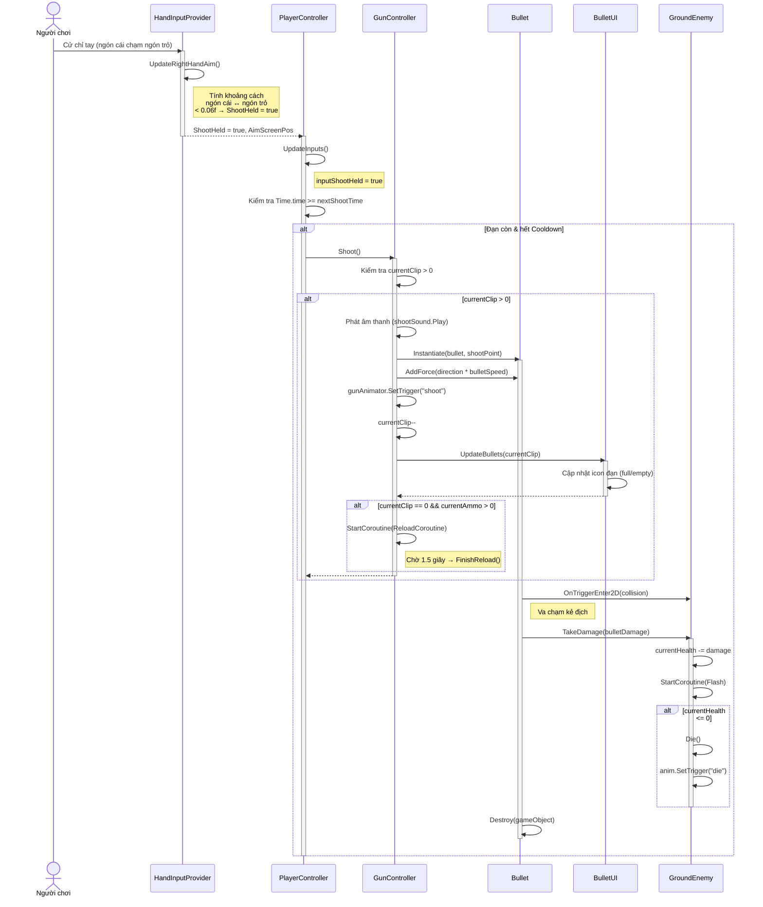
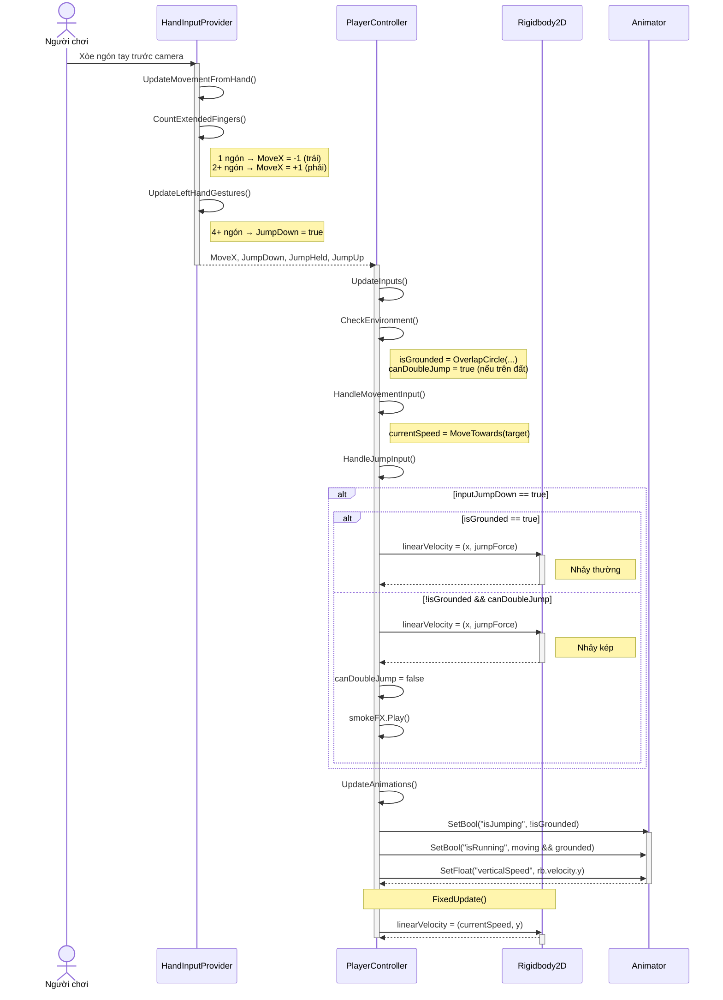
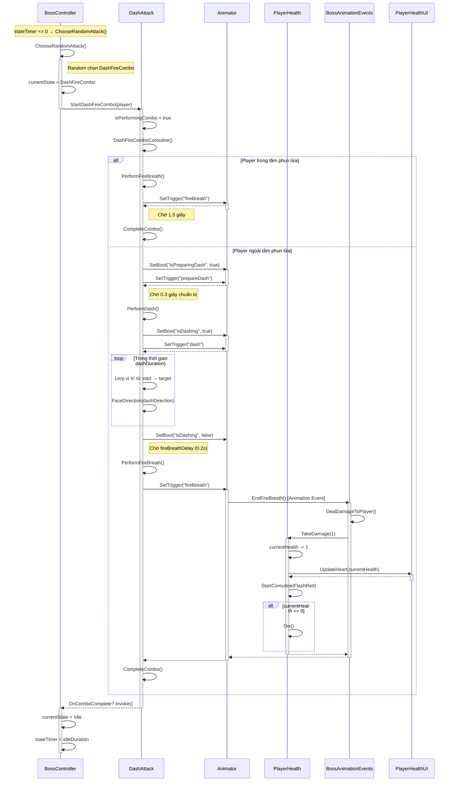
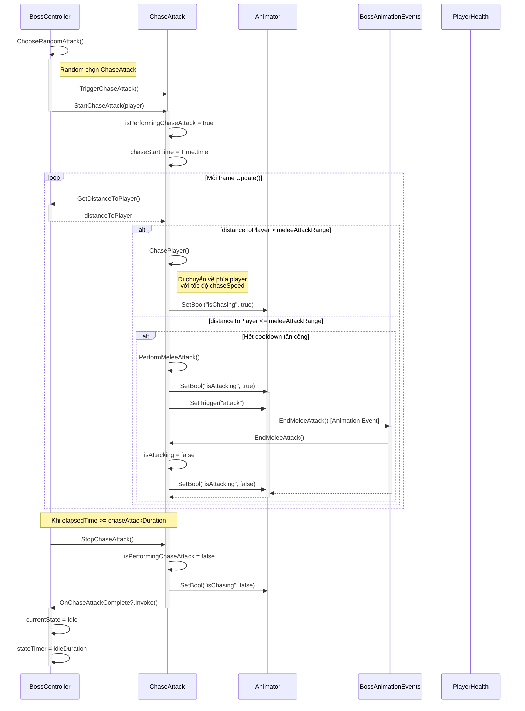
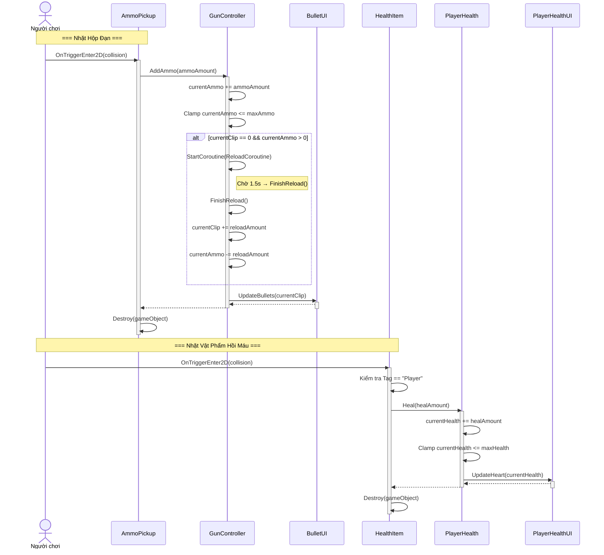
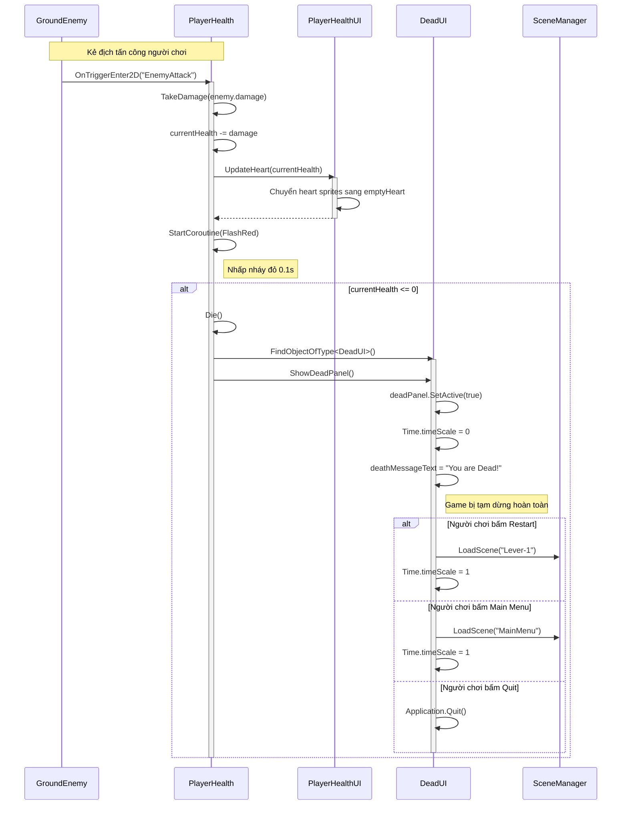
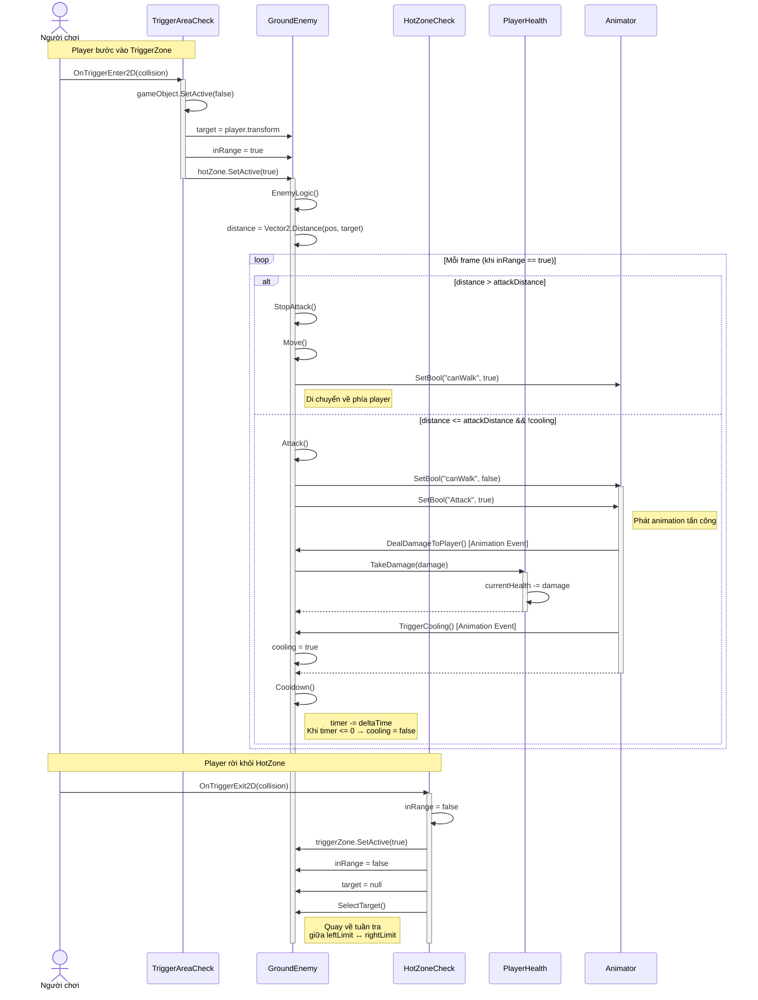
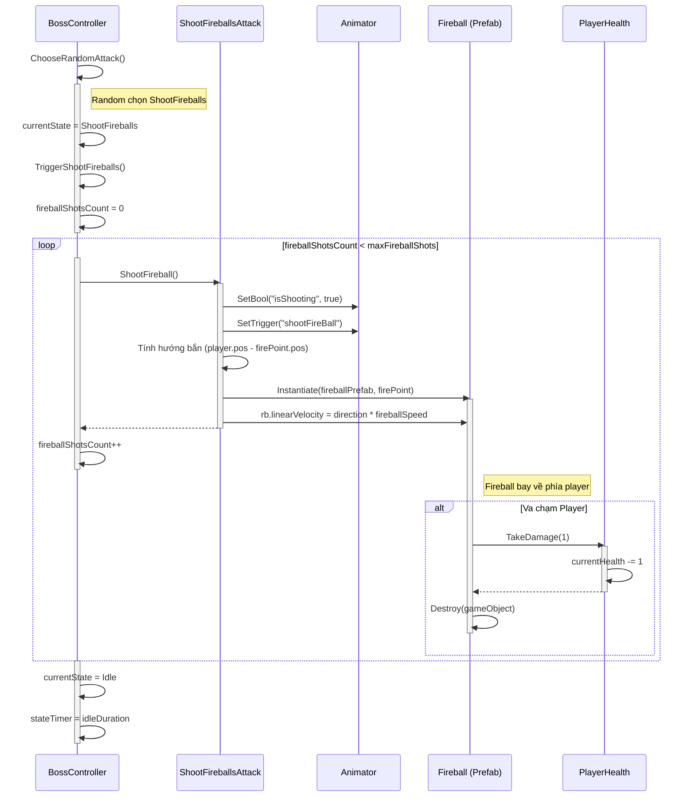

# Hướng Dẫn Vẽ Sơ Đồ Tuần Tự (Sequence Diagram)

Tài liệu này hướng dẫn cách vẽ sơ đồ tuần tự (Sequence Diagram) theo chuẩn UML cho dự án game **Demon King vs Rambo Frog** (Hand Tracking). Sơ đồ tuần tự thể hiện **thứ tự tương tác theo thời gian** giữa các đối tượng trong một kịch bản (use case) cụ thể.

---

## 1. Kiến Thức Cơ Bản Về Sequence Diagram

### 1.1. Sequence Diagram là gì?

Sequence Diagram (Sơ đồ tuần tự) là một loại sơ đồ tương tác trong UML, mô tả:

*   **Các đối tượng (Objects/Actors)** tham gia vào một kịch bản.
*   **Thứ tự các thông điệp (Messages)** được gửi giữa các đối tượng theo **trục thời gian dọc** (từ trên xuống).
*   **Thời gian sống (Lifeline)** và **khoảng hoạt động (Activation Bar)** của mỗi đối tượng.

### 1.2. Các Thành Phần Chính

```
   Tác nhân        :Đối tượng A          :Đối tượng B          :Đối tượng C
   (Actor)         ┌──────────┐          ┌──────────┐          ┌──────────┐
      ○            │  Tên A   │          │  Tên B   │          │  Tên C   │
     /|\           └────┬─────┘          └────┬─────┘          └────┬─────┘
     / \                │                     │                     │
      │                 │───── Thông điệp ───>│                     │
      │                 │                     │── Thông điệp ──────>│
      │                 │                     │<── Phản hồi ────────│
      │                 │<──── Phản hồi ──────│                     │
      │                 │                     │                     │
```

### 1.3. Ký Hiệu UML Trong Sequence Diagram

| Ký hiệu                  | Tên gọi                | Mô tả                                                                |
|---------------------------|------------------------|-----------------------------------------------------------------------|
| `──────────>`             | Synchronous Message     | Thông điệp đồng bộ (lời gọi hàm, chờ phản hồi)                     |
| `- - - - - ->`            | Asynchronous Message    | Thông điệp bất đồng bộ (gửi đi không chờ phản hồi)                 |
| `<─ ─ ─ ─ ─ ─`           | Return Message          | Thông điệp phản hồi / giá trị trả về (đường đứt nét)                |
| `──────────>│`            | Self-call               | Đối tượng gọi chính nó                                               |
| `█` (thanh dọc trên lifeline) | Activation Bar      | Khoảng thời gian đối tượng đang xử lý (đang thực thi)               |
| `│` (đường dọc đứt nét)  | Lifeline               | Đường sống của đối tượng theo trục thời gian                         |
| `[điều kiện]`             | Guard / Condition       | Điều kiện để thông điệp được gửi (đặt trong ngoặc vuông)            |
| `X`                       | Object Destruction      | Đối tượng bị hủy                                                     |
| `╔══ alt ══╗`             | Alt Fragment            | Khối rẽ nhánh (if/else)                                              |
| `╔══ loop ═╗`             | Loop Fragment           | Khối lặp (while/for)                                                 |
| `╔══ opt ══╗`             | Opt Fragment            | Khối tùy chọn (chỉ thực hiện nếu điều kiện đúng)                    |

---

## 2. Các Kịch Bản Sequence Diagram Quan Trọng

Dưới đây là các kịch bản (use case) chính trong dự án, kèm mã Mermaid hoàn chỉnh:

---

### 2.1. Kịch bản 1: Người Chơi Bắn Súng (Player Shoots)

**Mô tả**: Người chơi thực hiện hành động bắn súng, từ lúc nhận input đến khi đạn va chạm với kẻ địch.



---

### 2.2. Kịch bản 2: Người Chơi Di Chuyển & Nhảy (Player Movement & Jump)

**Mô tả**: Luồng xử lý input di chuyển và nhảy (hỗ trợ nhảy kép) từ Hand Tracking.



---

### 2.3. Kịch bản 3: Boss Tấn Công Dash + Phun Lửa (Dash-Fire Combo)

**Mô tả**: Boss thực hiện combo Dash lướt nhanh về phía người chơi rồi phun lửa.



---

### 2.4. Kịch bản 4: Boss Đuổi & Tấn Công Cận Chiến (Chase Attack)

**Mô tả**: Boss đuổi theo người chơi và thực hiện tấn công cận chiến khi đến gần.



---

### 2.5. Kịch bản 5: Nhặt Vật Phẩm (Item Pickup)

**Mô tả**: Người chơi va chạm với hộp đạn hoặc vật phẩm hồi máu.



---

### 2.6. Kịch bản 6: Người Chơi Chết & Hiển Thị UI (Player Death)

**Mô tả**: Luồng xử lý khi người chơi chết do bị kẻ địch tấn công hoặc rơi vào bẫy.



---

### 2.7. Kịch bản 7: Enemy Mặt Đất Phát Hiện & Tấn Công (GroundEnemy AI)

**Mô tả**: Luồng xử lý AI khi kẻ địch mặt đất phát hiện và tấn công người chơi.



---

### 2.8. Kịch bản 8: Boss Bắn Cầu Lửa (Shoot Fireballs)

**Mô tả**: Boss bắn cầu lửa về phía người chơi.



---

## 3. Ký Hiệu UML Tóm Tắt Cho Sequence Diagram

| Thành phần                | Cách vẽ trên Draw.io                                                |
|---------------------------|----------------------------------------------------------------------|
| **Actor (Tác nhân)**       | Hình người que (stickman) ở đầu lifeline                           |
| **Object (Đối tượng)**    | Hộp chữ nhật chứa tên đối tượng (`:TênLớp`)                       |
| **Lifeline (Đường sống)** | Đường đứt nét kéo dọc xuống từ Object                               |
| **Activation Bar**         | Thanh chữ nhật mỏng trên lifeline (đối tượng đang xử lý)           |
| **Synchronous Message**    | Mũi tên đặc (→) với nhãn tên phương thức                           |
| **Return Message**         | Mũi tên đứt nét (⇢) quay về object gọi                            |
| **Self-call**              | Mũi tên vòng lại chính lifeline đó                                  |
| **Alt Fragment**           | Hộp viền đứt nét có nhãn `alt` ở góc trái, chia bằng đường ngang   |
| **Loop Fragment**          | Hộp viền đứt nét có nhãn `loop` ở góc trái                         |
| **Opt Fragment**           | Hộp viền đứt nét có nhãn `opt` ở góc trái                          |
| **Note**                   | Hộp nhỏ ghi chú, nối vào lifeline bằng đường đứt nét               |
| **Destroy (X)**            | Dấu X lớn ở cuối lifeline                                           |

---

## 4. Hướng Dẫn Vẽ Sequence Diagram Trên Draw.io

### Bước 1: Nhập sơ đồ từ Mermaid (Cách nhanh nhất)

1.  Truy cập [Draw.io](https://app.diagrams.net).
2.  Bấm **+ (Insert)** → **Advanced** → **Mermaid**.
3.  Sao chép đoạn mã Mermaid của kịch bản bạn muốn vẽ (từ **Mục 2**) và dán vào hộp thoại.
4.  Bấm **Insert** → Draw.io tự động sinh sơ đồ tuần tự.
5.  Chỉnh sửa bố cục, căn chỉnh lại các lifeline cho đều nhau.

### Bước 2: Vẽ thủ công (Chi tiết hơn)

#### a. Tạo các đối tượng (Participants)

1.  Bật thư viện **UML** ở panel bên trái (More Shapes → UML).
2.  Tìm hình **Lifeline** hoặc **Object** và kéo thả lên canvas.
3.  Sắp xếp các đối tượng **theo hàng ngang** ở phía trên cùng:
    ```
    [Người chơi]   [HandInputProvider]   [PlayerController]   [GunController]   [Bullet]
    ```
4.  Kéo **đường dọc đứt nét** (Lifeline) từ mỗi đối tượng xuống dưới.

#### b. Vẽ các thông điệp

1.  Dùng **Arrow** (mũi tên) để nối từ lifeline A sang lifeline B.
2.  **Double-click** vào mũi tên để thêm nhãn (tên phương thức được gọi).
3.  Dùng **Dashed Arrow** (mũi tên đứt nét) cho **Return Message**.

#### c. Thêm Activation Bar

1.  Vẽ một **Rectangle nhỏ dọc** (hẹp, cao) đặt trên lifeline tại vị trí đối tượng đang xử lý.
2.  Bắt đầu activation bar khi nhận thông điệp, kết thúc khi gửi return message.

#### d. Thêm Fragment (alt/loop/opt)

1.  Vẽ một **Rectangle viền đứt nét** bao quanh nhóm thông điệp cần đặt điều kiện.
2.  Thêm nhãn ở góc trái trên (ví dụ: `alt`, `loop`, `opt`).
3.  Nếu là `alt`, vẽ **đường ngang đứt nét** ở giữa để phân chia hai nhánh (if/else).
4.  Ghi điều kiện trong **[ngoặc vuông]** trên đường phân chia.

### Bước 3: Tô màu và hoàn thiện

*   **Actor (Người chơi)**: Màu xanh dương (`#3B82F6`).
*   **Nhóm Player**: Lifeline và activation bar màu xanh lá (`#10B981`).
*   **Nhóm Boss**: Lifeline và activation bar màu đỏ (`#EF4444`).
*   **Nhóm Enemy**: Lifeline và activation bar màu cam (`#F59E0B`).
*   **Nhóm UI**: Lifeline và activation bar màu tím (`#8B5CF6`).
*   **Fragment alt/loop**: Viền màu xám đậm, nền trong suốt hoặc xám rất nhạt.

---

## 5. Mẹo Vẽ Sequence Diagram Chuẩn

1.  **Đặt tên đối tượng theo format `:TênLớp`**: Ví dụ `:PlayerController`, `:GunController`. Dấu `:` ở đầu cho biết đây là một **instance** (thể hiện) của lớp đó.

2.  **Thứ tự đối tượng từ trái sang phải**: Sắp xếp theo thứ tự tương tác. Đối tượng gọi đầu tiên đặt bên trái, đối tượng nhận cuối cùng đặt bên phải.

3.  **Nhãn thông điệp = Tên phương thức**: Ghi rõ tên hàm được gọi, ví dụ `Shoot()`, `TakeDamage(1)`, `AddAmmo(7)`.

4.  **Sử dụng Fragment hợp lý**: Chỉ dùng `alt`, `loop`, `opt` khi cần thiết, tránh lồng quá nhiều fragment gây rối.

5.  **Thêm Note khi cần giải thích**: Dùng Note (hộp ghi chú) để giải thích logic phức tạp mà không thể hiện rõ qua tên phương thức.

6.  **Đồng bộ vs Bất đồng bộ**: 
    *   `Instantiate()`, `Destroy()` → Dùng mũi tên **đồng bộ** (mũi tên đặc).
    *   `StartCoroutine()` → Dùng mũi tên **bất đồng bộ** (mũi tên đứt nét) vì coroutine chạy trên nhiều frame.

7.  **Giữ sơ đồ tập trung**: Mỗi Sequence Diagram chỉ nên mô tả **một kịch bản cụ thể**. Không cố gắng nhồi nhiều use case vào 1 sơ đồ.

---

## 6. Bảng Tổng Hợp Các Kịch Bản

| # | Kịch bản                          | Đối tượng chính                                             | Số lượng message |
|---|-------------------------------------|-------------------------------------------------------------|------------------|
| 1 | Người chơi bắn súng               | Player → HIP → PC → GC → Bullet → Enemy                   | ~15              |
| 2 | Di chuyển & nhảy                   | Player → HIP → PC → RB → Animator                          | ~12              |
| 3 | Boss Dash-Fire Combo               | BC → DA → Anim → BAE → PH                                  | ~20              |
| 4 | Boss Chase Attack                  | BC → CA → Anim → BAE → PH                                  | ~15              |
| 5 | Nhặt vật phẩm                      | Player → AmmoPickup/HealthItem → GC/PH → UI                | ~10              |
| 6 | Người chơi chết                    | Enemy → PH → PHUI → DeadUI → SceneManager                  | ~12              |
| 7 | GroundEnemy AI                     | Player → TAC → GE → HZC → PH → Anim                       | ~18              |
| 8 | Boss bắn cầu lửa                   | BC → SFA → Anim → Fireball → PH                            | ~12              |
