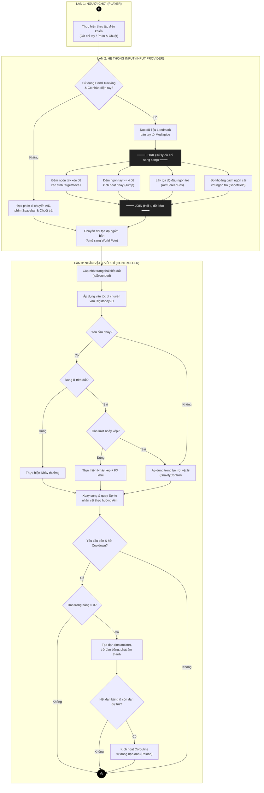

# Hướng Dẫn Vẽ Sơ Đồ Hoạt Động (Swimlane Activity Diagram)

Tài liệu này hướng dẫn cách vẽ sơ đồ hoạt động phân làn (Swimlane Activity Diagram) mô phỏng vòng lặp xử lý Input và Phản hồi vật lý/vũ khí của dự án game **Demon King vs Rambo Frog**.

---

## 1. Phân Tích Luồng Hoạt Động & Phân Làn (Swimlanes)

Để thể hiện đúng chuẩn UML Swimlane, sơ đồ được chia thành **3 làn dọc (Columns)** ứng với 3 thực thể tham gia vào luồng xử lý:

*   **Làn 1: Người chơi (Player):** Đại diện cho tác nhân bên ngoài thực hiện các thao tác (Cử chỉ tay trước camera hoặc bấm phím & chuột).
*   **Làn 2: Hệ Thống Input (Input Provider):** Chịu trách nhiệm chuyển đổi dữ liệu thô (Landmarks hoặc KeyCodes) thành biến trạng thái điều khiển và dịch chuyển tọa độ Aim sang không gian thế giới.
*   **Làn 3: Nhân Vật & Vũ Khí (Controller):** Nhận biến trạng thái điều khiển để thực thi các hành động vật lý (di chuyển, nhảy, nhảy kép), xoay súng và bắn/nạp đạn.

---

## 2. Ký Hiệu UML Được Sử Dụng (Theo Chuẩn)

1.  **Start Node (Điểm bắt đầu):** Vẽ bằng một chấm tròn đặc màu đen `●`.
2.  **End Node (Điểm kết thúc):** Vẽ bằng một hình tròn viền kép `◎`.
3.  **Activity (Hành động):** Vẽ bằng hộp chữ nhật bo tròn góc đại diện cho các hàm xử lý tính toán.
4.  **Condition / Decision Node (Điểm quyết định):** Vẽ bằng hình thoi để rẽ nhánh luồng dữ liệu (có nhãn Đúng/Sai, Có/Không ở các nhánh đầu ra).
5.  **Fork / Join (Thanh song song):** Vẽ bằng một **thanh đen dày nằm ngang** để biểu diễn luồng xử lý đồng thời (Fork: tách 1 luồng thành nhiều luồng chạy cùng lúc; Join: gộp các luồng chạy song song lại thành 1 luồng duy nhất).

---

## 3. Mã Code Mermaid (Sơ đồ Mẫu)

Bạn có thể sao chép đoạn mã này để hiển thị sơ đồ trực tiếp hoặc nhập vào Draw.io:

---

## 4. Hướng Dẫn Vẽ và Xuất Sơ Đồ trên Draw.io

### Bước 1: Nhập sơ đồ thô qua chức năng Mermaid của Draw.io
1.  Truy cập [Draw.io](https://app.diagrams.net).
2.  Bấm vào nút **`+` (Insert/Chèn)** trên thanh công cụ phía trên $\rightarrow$ Chọn **Advanced (Nâng cao)** $\rightarrow$ **Mermaid**.
3.  Sao chép toàn bộ đoạn mã Mermaid ở phần trên dán vào hộp thoại hiện ra và bấm **Insert (Chèn)**.
4.  Lúc này, Draw.io sẽ tự động vẽ tất cả các khối hình và nối các mũi tên liên kết giữa chúng.

### Bước 2: Tạo Làn dọc (Swimlanes / Pool) chuẩn
1.  Trong bảng thư viện hình bên trái màn hình, nhấn vào nhóm **Cơ bản (Basic)** hoặc **UML**.
2.  Tìm hình có tên **Pool (Bể bơi)** hoặc **Swimlane** (Cột chia làn dọc giống tiêu đề biểu đồ *Return Car*). Kéo và thả nó vào màn hình thiết kế của bạn.
3.  Double-click vào phần tiêu đề để đổi tên thành: **Người chơi (Player)**, **Hệ thống Input**, và **Nhân vật & Vũ khí**.

### Bước 3: Sắp xếp các khối hình vào Làn và căn chỉnh lại
1.  Chọn các **khung hình chữ nhật nền màu xám lớn** (do Mermaid tự tạo ra để gom nhóm) $\rightarrow$ bấm **Delete** để xóa chúng. Giờ bạn chỉ còn các nút hành động đơn lẻ trên canvas.
2.  Kéo thả các khối đã sinh ra đặt vào đúng các cột dọc tương ứng:
    *   **Cột 1 (Player):** Chứa nút bắt đầu `●` và hộp `Thực hiện thao tác điều khiển`.
    *   **Cột 2 (Input Provider):** Chứa các hộp xử lý Mediapipe, bộ lọc Fork/Join, phím KBM và chuyển tọa độ World Point.
    *   **Cột 3 (Controller):** Chứa tất cả các hộp xử lý nhảy, di chuyển, bắn đạn, nạp đạn và chấm tròn kết thúc `◎`.
3.  Khi bạn kéo thả hình, các mũi tên nối sẽ tự động co giãn đi theo hình đó. Bạn chỉ cần chỉnh lại đường đi của mũi tên cho thẳng đẹp.
